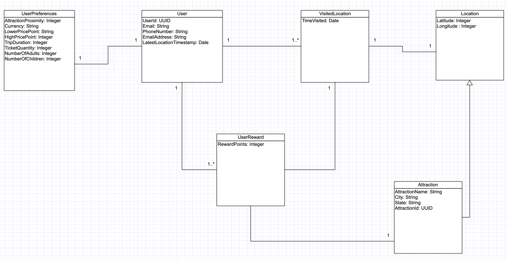

# Tour guide

TourGuide est une application existante qui permet aux utilisateurs de voir les attractions touristiques à proximité et d’obtenir des réductions sur les séjours à l’hôtel ainsi que sur les billets de différents spectacles.
# Diagramme de classe

# Architecture

## Getting Started

Comment lancer le projet?

### Prerequisites

- Java 1.8
- Gradle 2.1.6

### Installing

1. installez Java:

https://docs.oracle.com/javase/8/docs/technotes/guides/install/install_overview.html

2. installez Gradle:

https://gradle.org/install/

### Running App
Vous pouvez importer le code dans un IDE de votre choix et exécuter Application.java pour lancer l'application.

### Testing

Pour exécuter les tests à partir de maven, accédez au dossier contenant le fichier pom.xml et exécutez la commande ci-dessous.

gradlew test

### The final Jar file

gradlew build

